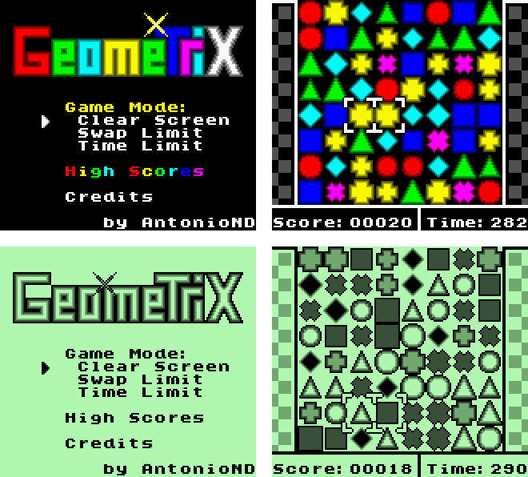

GEOMETRIX
=========

Introduction
------------

This is a very simple puzzle game in which the objective is to create rows or
columns of 3 or more of the same geometric form. It's compatible with all models
of Game Boy.

Each row or column of 3 is worth 1 point, a line of 4 elements is considered to
be 2 lines of 3 together, so it's worth 2 points, etc. If removing a line allows
another one to be removed, the combo counter increases and the score of that
removal is multiplied by it. The combo counter may increase up to 9.  As soon as
new geometric forms come into the screen from the top, or the chain stops, the
combo counter will go back to 1.

There are 3 game modes.

- Remove all: The objective is to remove all geometric forms. If there are only
  1 or 2 forms of any type the game won't be able to end, and you will lose. If
  you remove all, you win. High scores aren't saved.
- Swap limit: You have to score as much points as possible until the swap
  counter reaches 0. High scores are saved.
- Time limit: You have to score as much points as possible until the time
  counter reaches 0. High scores are saved.

Video: https://www.youtube.com/watch?v=qAvW2n8Qbeg

Controls
--------

- PAD: Move cursor
- A: Swap forms in the cursor.
- B: Rotate cursor.
- Start: Pause.

Credits
-------

Game made by AntonioND/SkyLyrac (Antonio Niño Díaz)
Music player: GBT Player

Email:  antonio_nd@outlook.com / antonionidi@gmail.com

Web: www.skylyrac.net

GitHub: https://github.com/AntonioND

This game is licensed under the GPL v3 license. You may have received the source
code of this game along with the ROM file. If not, the source code is freely
available at the following address: https://github.com/AntonioND/geometrix

RGBDS needed: https://github.com/bentley/rgbds/

License
-------

    Geometrix - A simple puzzle game for Game Boy and Game Boy Color.
    Copyright (c) 2015, 2018 Antonio Niño Díaz (AntonioND/SkyLyrac)

    This program is free software: you can redistribute it and/or modify
    it under the terms of the GNU General Public License as published by
    the Free Software Foundation, either version 3 of the License, or
    (at your option) any later version.

    This program is distributed in the hope that it will be useful,
    but WITHOUT ANY WARRANTY; without even the implied warranty of
    MERCHANTABILITY or FITNESS FOR A PARTICULAR PURPOSE.  See the
    GNU General Public License for more details.

    You should have received a copy of the GNU General Public License
    along with this program.  If not, see <http://www.gnu.org/licenses/>.
